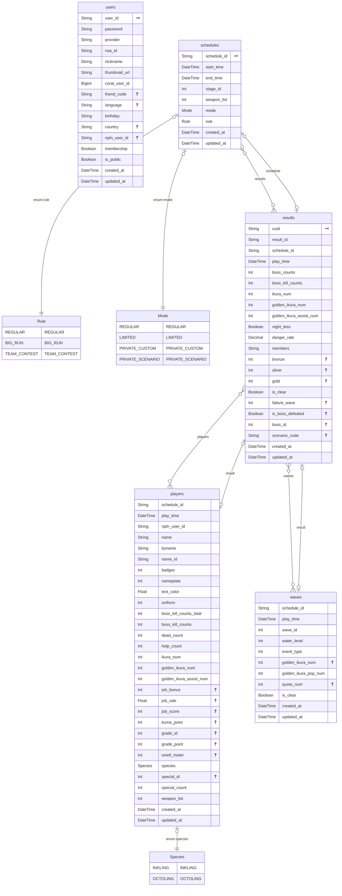

```mermaid
erDiagram

        Rule {
            REGULAR REGULAR
BIG_RUN BIG_RUN
TEAM_CONTEST TEAM_CONTEST
        }
    


        Mode {
            REGULAR REGULAR
LIMITED LIMITED
PRIVATE_CUSTOM PRIVATE_CUSTOM
PRIVATE_SCENARIO PRIVATE_SCENARIO
        }
    


        Species {
            INKLING INKLING
OCTOLING OCTOLING
        }
    
  "users" {
    String user_id "🗝️"
    String password 
    String provider 
    String nsa_id 
    String nickname 
    String thumbnail_url 
    BigInt coral_user_id 
    String friend_code "❓"
    String language "❓"
    String birthday 
    String country "❓"
    String npln_user_id "❓"
    Boolean membership 
    Boolean is_public 
    DateTime created_at 
    DateTime updated_at 
    }
  

  "schedules" {
    String schedule_id "🗝️"
    DateTime start_time 
    DateTime end_time 
    Int stage_id 
    Int weapon_list 
    Mode mode 
    Rule rule 
    DateTime created_at 
    DateTime updated_at 
    }
  

  "results" {
    String uuid "🗝️"
    String result_id 
    String schedule_id 
    DateTime play_time 
    Int boss_counts 
    Int boss_kill_counts 
    Int ikura_num 
    Int golden_ikura_num 
    Int golden_ikura_assist_num 
    Boolean night_less 
    Decimal danger_rate 
    String members 
    Int bronze "❓"
    Int silver "❓"
    Int gold "❓"
    Boolean is_clear 
    Int failure_wave "❓"
    Boolean is_boss_defeated "❓"
    Int boss_id "❓"
    String scenario_code "❓"
    DateTime created_at 
    DateTime updated_at 
    }
  

  "players" {
    String schedule_id 
    DateTime play_time 
    String npln_user_id 
    String name 
    String byname 
    String name_id 
    Int badges 
    Int nameplate 
    Float text_color 
    Int uniform 
    Int boss_kill_counts_total 
    Int boss_kill_counts 
    Int dead_count 
    Int help_count 
    Int ikura_num 
    Int golden_ikura_num 
    Int golden_ikura_assist_num 
    Int job_bonus "❓"
    Float job_rate "❓"
    Int job_score "❓"
    Int kuma_point "❓"
    Int grade_id "❓"
    Int grade_point "❓"
    Int smell_meter "❓"
    Species species 
    Int special_id "❓"
    Int special_count 
    Int weapon_list 
    DateTime created_at 
    DateTime updated_at 
    }
  

  "waves" {
    String schedule_id 
    DateTime play_time 
    Int wave_id 
    Int water_level 
    Int event_type 
    Int golden_ikura_num "❓"
    Int golden_ikura_pop_num 
    Int quota_num "❓"
    Boolean is_clear 
    DateTime created_at 
    DateTime updated_at 
    }
  
    "schedules" o|--|| "Mode" : "enum:mode"
    "schedules" o|--|| "Rule" : "enum:rule"
    "schedules" o{--}o "results" : "results"
    "results" o{--}o "waves" : "waves"
    "results" o{--}o "players" : "players"
    "results" o|--|o "schedules" : "schedule"
    "players" o|--|| "Species" : "enum:species"
    "players" o|--|o "results" : "result"
    "waves" o|--|o "results" : "result"
```
